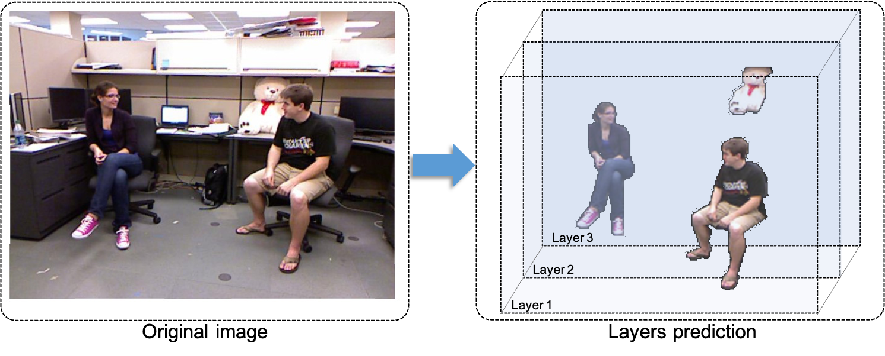

# Depth Based Adaptable Image Layer Prediction using Bidirectional Depth Semantic Fusion
Official PyTorch implementation of the paper "Depth-Based Adaptable Image Layer Prediction using Bidirectional Depth Semantic Fusion" and the code will be coming soon. 🎈

## Overview

Image editing is a laborious process that demands considerable effort to achieve visually appealing outcomes. 
To address this problem, we propose a novel method Depth-based Adaptable Image Layer Prediction Network for multi-object semantic segmentation, localization, and estimation of the relative depths for image layer prediction. The individual objects in an image are available to be extracted and edited without impacting the background or other objects. 
Our approach Depth Semantic Prediction Network utilizes a fusion module to bi-directionally optimize depth estimation as well as semantic segmentation. In addition, Refinement Network is designed to refine coarse results into fine segmentation. 
Experimental results demonstrate the salient progress our method has achieved, and that it can preserve spatial hierarchical relationships and avoid category constraints as well. To the best of our knowledge, we introduces a novel approach to image layer prediction, which is more adaptive than the editing method focusing on foreground and background extraction. 
